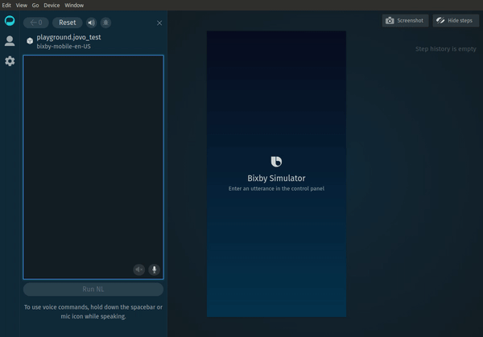

# Jovo Template: Samsung Bixby Audioplayer

This template contains a Jovo Sample Bixby Capsule, that plays a longform audio file with the Bixby AudioPlayer functionality.

## Quick Start

### Setting up your Jovo app

To use the Jovo Templates, you'll need the Jovo CLI. You can install it globally with NPM.

```sh
$ npm install -g jovo-cli
```

After successfully installing the Jovo CLI, you can install the template using one of the following commands:

```sh
$ jovo new <directory> --template bixby/audioplayer
```

> Read more about `jovo new` [here](https://www.jovo.tech/marketplace/jovo-cli#jovo-new).

Change your working directory into your newly created project directory and run your voice app:

```sh
# Change working directory to your previously specified directory.
$ cd <directory>

# Install dependencies.
$ npm install

# Run voice app, optionally with a --watch flag to restart on code changes.
$ jovo run [-w]
```

> Read more about `jovo run` [here](https://www.jovo.tech/marketplace/jovo-cli#jovo-run).

### Installing Bixby Studio

Next up, you need to download the Bixby Developer Studio. It functions as an IDE and allows you to develop, test and publish your capsules. Although you can edit your capsule files in your own environment, we strongly recommend using Bixby Studio for all your work inside the capsule, as external changes can easily break it or lead to undesired behavior.

> You can download the Bixby Developer Studio [here](https://bixbydevelopers.com/).

After the installation has finished, start Bixby Studio and open the capsule by going to `File` -> `Open Capsule...` -> `./platforms/bixby/`.

### Configuring your capsule

In the left panel, you should now see your capsule `playground.jovo_test` listed there. 

> You can read more about Bixby-specific files [here](https://www.jovo.tech/tutorials/samsung-bixby-hello-world#understanding-the-underlying-principles).

Open the training tool by selecting the file `./resources/en/training` and compile your training model by clicking on `Compile NL Model`. This will generate a plan for every utterance, defining the exact route Bixby is going to take and what inputs to gather, when the corresponding utterance is triggered.

Now you need to provide Bixby with a remote url, so it knows where to send requests to upon a user prompt. To do this, open the file `./resources/base/capsule.properties` and paste your copied webhook url into the respective property field.

```
# capsule.properties

config.default.remote.url=https://webhook.jovo.cloud/xxxxxxxx-xxxx-xxx-xxxx-xxxxxxxxxxxx
```

### Running your first query

To finally test your capsule, open the Bixby Simulator, which allows you to test your capsule in a variety of simulated scenarios and analyze the execution graph of your last tested utterance. You can launch it by going to `View` -> `Open Simulator` or by clicking on the Bixby Simulator button:



Congrats, you just ran your first query in your capsule.

## Next Steps

Now that you got the template running, you can take the time to read more about Bixby-specific files [here](https://www.jovo.tech/tutorials/samsung-bixby-hello-world#understanding-the-underlying-principles). You can also check out other templates for Samsung Bixby, which you can find [here](https://www.jovo.tech/news/2020-03-05-samsung-bixby-jovo#2-jovo-templates-for-bixby).

To see what else you can do with the Jovo Framework, take a look at the [Jovo Documentation](https://www.jovo.tech/docs/).

## About Jovo

Jovo is the most popular development framework for voice, including platforms like Alexa, Google Assistant, mobile apps, and Raspberry Pi.

-   [Jovo Website](https://jovo.tech/)
-   [Documentation](https://jovo.tech/docs/)
-   [Marketplace](https://www.jovo.tech/marketplace/)
-   [Twitter](https://twitter.com/jovotech/)
-   [Forum](https://community.jovo.tech/)
